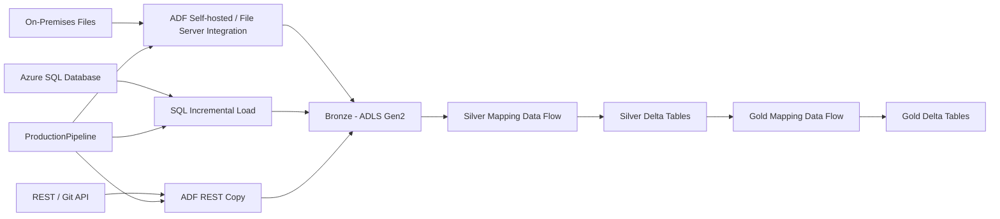

# Azure Data Factory Medallion Architecture Project

A hands-on **Azure Data Factory (ADF)** data engineering project that demonstrates how to build an end-to-end data ingestion and transformation platform using multiple source systems, Azure Data Lake Storage Gen2, Azure SQL Database, REST APIs, Mapping Data Flows, and a Bronze–Silver–Gold medallion architecture.

The repository contains the exported ADF artifacts for the project, including pipelines, datasets, linked services, integration runtime configuration, Mapping Data Flows, and the Data Factory definition.

## Architecture



## What This Project Demonstrates

- Ingesting data from **on-premises file sources** into Azure Data Lake Storage Gen2.
- Ingesting data from **Azure SQL Database** using an incremental-load pattern.
- Ingesting data from a **REST API / Git-based API source**.
- Organizing raw data in a **Bronze layer**.
- Transforming and cleansing data into a **Silver layer** using Mapping Data Flows.
- Creating business-oriented aggregations in a **Gold layer**.
- Using Delta format for Silver and Gold datasets.
- Using parameterized datasets and dynamic expressions.
- Using Lookup, Get Metadata, ForEach, Copy, Execute Pipeline, Execute Data Flow, and Web activities.
- Implementing upsert logic in the Silver layer.
- Implementing ranking and aggregation logic in the Gold layer.
- Orchestrating multiple ingestion pipelines through a production pipeline.
- Sending pipeline execution information to an external Logic App through a Web activity.

## Technology Stack

| Technology | Purpose |
|---|---|
| Azure Data Factory | Pipeline orchestration, ingestion, transformation and scheduling |
| Azure Data Lake Storage Gen2 | Bronze, Silver and Gold data storage |
| Azure SQL Database | Relational source and incremental data extraction |
| REST API | External/Git API ingestion |
| Mapping Data Flow | Data cleansing, transformation, joins, aggregation and ranking |
| Delta Lake format | Silver and Gold analytical storage |
| Parquet | Bronze storage for SQL fact data |
| JSON / CSV / TXT | Source and intermediate data formats |
| Azure Integration Runtime | Cloud connectivity and execution |
| Logic Apps | Pipeline status/error notification endpoint |

## Repository Structure

```text
ADF_project/
│
├── dataflow/
│   ├── DataTransformationForSilverLayer.json
│   └── DataTransormationForGoldLayer.json
│
├── dataset/
│   ├── CopyFromGit.json
│   ├── CopyOnPremFiles.json
│   ├── CopyOnPremFolder.json
│   ├── DumpFromGitToBronzeDL.json
│   ├── DumpToBronzeDataLake.json
│   ├── DumpToBronzeSQLData.json
│   ├── GitDataDimAirport.json
│   ├── OnPremDimAirline.json
│   ├── OnPremDimFlight.json
│   ├── OnPremDimPassenger.json
│   ├── SQLDataBronzeLayer.json
│   ├── ToUpdateLastLoad.json
│   ├── ds_AzureSqlDb.json
│   └── ds_lastLoad.json
│
├── factory/
│   └── ADFProject56.json
│
├── integrationRuntime/
│   └── AzureIRforProject.json
│
├── linkedService/
│   ├── ADLSBronze.json
│   ├── AzureProjectFileSystem.json
│   ├── AzureSqlDatabase.json
│   └── RestServiceForGit.json
│
├── pipeline/
│   ├── GoldLayer.json
│   ├── MigrateGitAPIData.json
│   ├── MigrateOnPremData.json
│   ├── ProductionPipeline.json
│   ├── SQLDataLoading.json
│   └── SilverLayer.json
│
└── publish_config.json
```

## End-to-End Data Flow

The main orchestration is implemented through `ProductionPipeline`.

```text
ProductionPipeline
        |
        v
MigrateOnPremData
        |
        v
MigrateGitAPIData
        |
        v
SQLDataLoading
        |
        v
Failure / Status Notification
```

The repository also contains independent Silver and Gold layer pipelines that execute the Mapping Data Flows.

## 1. On-Premises Data Ingestion

`MigrateOnPremData` discovers files from the configured on-premises folder using a **Get Metadata** activity.

A **ForEach** activity iterates over the discovered files and copies the data into the Bronze layer in ADLS Gen2.

The pipeline contains schema mappings for the following dimensions:

- `DimAirline`
- `DimFlight`
- `DimPassenger`

The copy operation uses dynamic dataset parameters so that the file being processed can be supplied at runtime.

## 2. REST / Git API Ingestion

`MigrateGitAPIData` uses an ADF **Copy Activity** with a REST source.

The API response is written to ADLS Gen2 in JSON format in the Bronze layer.

The pipeline uses RFC 5988 pagination support, allowing the REST connector to follow pagination links exposed by the API.

The resulting data includes the airport dimension used later by the Silver layer.

## 3. Incremental Azure SQL Load

`SQLDataLoading` implements an incremental extraction pattern for `dbo.FactBookings`.

The process is:

1. Read the previous successful load timestamp from `ds_lastLoad`.
2. Query the latest `booking_date` from `dbo.FactBookings`.
3. Extract only records where:

```sql
booking_date > lastLoad
AND booking_date <= latestLoad
```

4. Write the extracted records to the Bronze layer in **Parquet** format.
5. Update the stored last-load value after a successful copy.

This avoids repeatedly loading the entire fact table.

## 4. Bronze Layer

The Bronze layer stores ingested data with minimal transformation.

The project uses ADLS Gen2 as the storage layer and uses formats appropriate to each source. For example:

- SQL fact data → Parquet
- REST API data → JSON
- On-premises files → delimited text

The Bronze layer acts as the raw/landing layer from which downstream transformations are performed.

## 5. Silver Layer

The `SilverLayer` pipeline executes the `DataTransformationForSilverLayer` Mapping Data Flow.

### Silver sources

- Fact Bookings
- Airline dimension
- Flight dimension
- Passenger dimension
- Airport dimension

### Transformations implemented

The Mapping Data Flow performs several transformations, including:

- Data type conversion
- Filtering checked-in bookings
- Upper-casing airline country values
- Renaming flight timestamp columns
- Filtering passengers by age
- Normalizing gender values
- Splitting passenger full names into first and last names
- Applying upsert logic using business keys

### Silver outputs

The transformed datasets are written in **Delta format** under the Silver filesystem:

```text
silver/
├── FactBookings/
├── DimAirline/
├── DimFlight/
├── DimPassenger/
└── DimAirport/
```

The project uses upsert keys such as:

- `booking_id` for FactBookings
- `airline_id` for DimAirline
- `flight_id` for DimFlight
- `passenger_id` for DimPassenger
- `airport_id` for DimAirport

## 6. Gold Layer

The `GoldLayer` pipeline executes `DataTransormationForGoldLayer`.

The Gold transformation reads the Silver Delta datasets and creates business-level analytical outputs.

### Top airlines by total ticket cost

The flow:

1. Joins FactBookings with DimAirline.
2. Groups records by airline.
3. Calculates total ticket cost.
4. Applies a dense rank.
5. Filters the top five airlines.
6. Writes the result to:

```text
gold/TopAirlinesRevenue/
```

### Cheapest airport by total ticket cost

The flow:

1. Joins airport information with booking data.
2. Groups the data by airport.
3. Calculates total ticket cost.
4. Ranks airports by total cost.
5. Selects the lowest-ranked cost result.
6. Writes the result to:

```text
gold/CheapAirportRevenue/
```

## Pipeline Orchestration

The main production orchestration is:

```text
┌─────────────────────────┐
│    ProductionPipeline   │
└────────────┬────────────┘
             │
             v
┌─────────────────────────┐
│    MigrateOnPremData    │
└────────────┬────────────┘
             │ Success
             v
┌─────────────────────────┐
│    MigrateGitAPIData    │
└────────────┬────────────┘
             │ Success
             v
┌─────────────────────────┐
│     SQLDataLoading      │
└────────────┬────────────┘
             │
             v
┌─────────────────────────┐
│ Failure / Status Alert  │
└─────────────────────────┘
```

The production pipeline waits for each ingestion pipeline to complete successfully before starting the next stage.

## Monitoring and Notifications

`ProductionPipeline` contains a Web activity that sends pipeline execution information to a Logic App endpoint.

The notification payload contains information such as:

- Pipeline name
- Pipeline run ID
- Pipeline/activity status
- Error information when applicable

**Important:** The Logic App endpoint currently stored in the repository contains a SAS-style signature. This is a credential and should **not** be committed to source control. The exposed endpoint should be revoked/rotated and replaced with a secure configuration mechanism such as Azure Key Vault, managed identity, or ADF secure parameters.

## Prerequisites

Before deploying this project, you should have:

- An Azure subscription.
- Azure Data Factory.
- Azure Data Lake Storage Gen2.
- Azure SQL Database.
- Required source data/files.
- An Azure Integration Runtime appropriate for the source connectivity.
- Permissions to create and access the required Azure resources.
- A Logic App if notification functionality is required.

## Deployment / Setup

This repository contains ADF-generated JSON artifacts rather than application source code.

A typical setup is:

1. Create the required Azure resources.
2. Create or open an Azure Data Factory instance.
3. Configure the required Integration Runtime.
4. Configure the linked services for:
   - ADLS Gen2
   - Azure SQL Database
   - On-premises file storage
   - REST API
5. Configure datasets and their parameters.
6. Import or recreate the pipelines and Mapping Data Flows from the JSON artifacts.
7. Configure secure credentials and Key Vault references where appropriate.
8. Validate all connections.
9. Publish the Data Factory changes.
10. Execute the ingestion and transformation pipelines in the required order.

> **Do not copy credentials, encrypted credentials, SAS URLs, passwords, or connection secrets from this repository into another environment. Reconfigure them securely in the target Azure environment.**

## Configuration Considerations

The JSON artifacts reference environment-specific Azure resources, including storage and SQL resources. For use in another subscription or environment, update the corresponding linked services and datasets.

Recommended production practices include:

- Azure Key Vault for secrets.
- Managed identity authentication where supported.
- Parameterized linked services.
- Environment-specific configuration.
- Separate development, test and production Data Factories.
- Secure input/output settings for activities handling sensitive information.
- Azure Monitor / Log Analytics for operational monitoring.

## Data Model

The project is centered around a flight-booking domain.

### Fact table

`FactBookings` contains measures and foreign keys associated with bookings, including:

- Booking ID
- Passenger ID
- Flight ID
- Airline ID
- Origin Airport ID
- Destination Airport ID
- Booking Date
- Ticket Cost
- Flight Duration
- Check-in Status

### Dimension tables

- `DimAirline`
- `DimFlight`
- `DimPassenger`
- `DimAirport`

This structure provides a practical example of separating transactional facts from descriptive dimensions in a data warehouse-style model.

## Key ADF Activities Used

| Activity | Usage in Project |
|---|---|
| Get Metadata | Discover on-premises files |
| ForEach | Iterate over discovered files |
| Copy | Move data between source and target systems |
| Lookup | Determine incremental load boundaries |
| Execute Pipeline | Orchestrate child pipelines |
| Execute Data Flow | Run Silver and Gold transformations |
| Web | Send pipeline status to Logic App |

## Current Repository Notes

The repository currently contains the following ADF artifact categories:

- Pipelines
- Mapping Data Flows
- Datasets
- Linked Services
- Integration Runtime configuration
- Data Factory configuration
- Publish configuration

No separate trigger JSON artifact is currently present in the repository tree, so trigger configuration should be verified directly in the target Data Factory before deployment.

## Security Warning

This repository currently contains environment-specific connection configuration and a Logic App invocation URL with a SAS signature in `pipeline/ProductionPipeline.json`. Treat the signature as compromised because it has been committed to a public repository.

Recommended immediate actions:

1. Revoke or regenerate the exposed Logic App SAS signature.
2. Remove the secret-bearing URL from Git history if appropriate.
3. Use Key Vault, managed identity, or secure ADF configuration instead.
4. Review the linked-service JSON files for exposed credentials or credential metadata.
5. Rotate any credentials associated with resources committed to the repository.

## Learning Objectives

This project is useful for demonstrating practical Azure Data Engineering concepts, including:

- ADF pipeline development
- ETL/ELT orchestration
- Incremental data loading
- REST API ingestion
- On-premises data integration
- ADLS Gen2 data lake architecture
- Medallion architecture
- Mapping Data Flows
- Delta Lake storage
- Fact and dimension modeling
- Upsert processing
- Aggregation and ranking
- Pipeline monitoring and notification
- Git-based ADF artifact management

## Future Improvements

Potential improvements for production readiness include:

- Move all secrets to Azure Key Vault.
- Replace hard-coded environment-specific values with parameters.
- Add explicit trigger definitions and scheduling.
- Add automated CI/CD validation and deployment.
- Add data-quality checks between Bronze, Silver and Gold layers.
- Add retry policies appropriate to each activity.
- Add centralized monitoring and alerting.
- Add automated tests for Mapping Data Flow logic.
- Enable schema validation where appropriate instead of relying extensively on schema drift.
- Add documentation for source-to-target mappings.
- Add separate configuration for development, test and production environments.

## Author

**Dipak**

GitHub: [CodeWithDipak](https://github.com/CodeWithDipak)

## License

No license file is currently included in the repository. If this project is intended for public reuse, add an appropriate open-source license before accepting external contributions.
