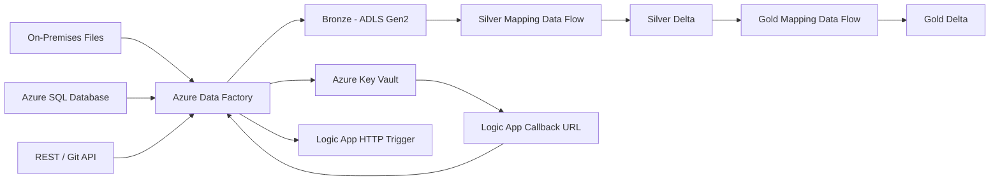

# Azure Data Factory Medallion Architecture Project

An end-to-end **Azure Data Factory (ADF)** data engineering project demonstrating multi-source ingestion, incremental loading, Medallion Architecture, Mapping Data Flows, Delta Lake storage, pipeline orchestration, and secure Logic App notifications.

The solution uses **Azure Data Factory, Azure Data Lake Storage Gen2, Azure SQL Database, REST API ingestion, Azure Key Vault, and Azure Logic Apps** to build a practical flight-booking data platform.

---

## Architecture



### End-to-end flow

```text
On-Prem Files ───────┐
                     │
Azure SQL ───────────┼──> Azure Data Factory ──> Bronze
                     │                              │
REST / Git API ──────┘                              ▼
                                             Silver Data Flow
                                                    │
                                                    ▼
                                               Silver Delta
                                                    │
                                                    ▼
                                              Gold Data Flow
                                                    │
                                                    ▼
                                                Gold Delta

ADF Managed Identity ──> Azure Key Vault ──> Logic App Callback URL
ADF Web Activity ──────────────────────────> Logic App HTTP Trigger
```

---

## What This Project Demonstrates

- Multi-source ingestion using Azure Data Factory.
- On-premises file ingestion into ADLS Gen2.
- REST API ingestion.
- Incremental loading from Azure SQL Database.
- Bronze, Silver and Gold **Medallion Architecture**.
- Mapping Data Flow transformations.
- Delta Lake-based Silver and Gold storage.
- Fact and dimension processing.
- Upsert logic using business keys.
- Parameterized datasets and dynamic expressions.
- Child-pipeline orchestration.
- Pipeline status/error notification through Azure Logic Apps.
- Secure retrieval of a Logic App callback URL from **Azure Key Vault using ADF Managed Identity**.
- Git-based management of ADF JSON artifacts.

---

## Technology Stack

| Technology | Purpose |
|---|---|
| **Azure Data Factory** | Pipeline orchestration, ingestion and transformation |
| **Azure Data Lake Storage Gen2** | Bronze, Silver and Gold storage |
| **Azure SQL Database** | Relational source and incremental extraction |
| **REST API** | External/Git API ingestion |
| **Azure Key Vault** | Secure storage of Logic App callback URL |
| **Azure Logic Apps** | Pipeline status/error notification |
| **Mapping Data Flow** | Cleansing, joins, transformations, aggregation and ranking |
| **Delta Lake** | Silver and Gold analytical storage |
| **Parquet** | Bronze storage for SQL fact data |
| **Azure Integration Runtime** | Data movement and execution |
| **GitHub** | Source control for ADF artifacts |

---

## Repository Structure

```text
ADF_project/
│
├── dataflow/
│   ├── DataTransformationForSilverLayer.json
│   └── DataTransormationForGoldLayer.json
│
├── dataset/
│   ├── CopyFromGit.json
│   ├── CopyOnPremFiles.json
│   ├── CopyOnPremFolder.json
│   ├── DumpFromGitToBronzeDL.json
│   ├── DumpToBronzeDataLake.json
│   ├── DumpToBronzeSQLData.json
│   ├── GitDataDimAirport.json
│   ├── OnPremDimAirline.json
│   ├── OnPremDimFlight.json
│   ├── OnPremDimPassenger.json
│   ├── SQLDataBronzeLayer.json
│   ├── ToUpdateLastLoad.json
│   ├── ds_AzureSqlDb.json
│   └── ds_lastLoad.json
│
├── factory/
│   └── ADFProject56.json
│
├── integrationRuntime/
│   └── AzureIRforProject.json
│
├── linkedService/
│   ├── ADLSBronze.json
│   ├── AzureProjectFileSystem.json
│   ├── AzureSqlDatabase.json
│   ├── LS_AzureKeyVault.json
│   └── RestServiceForGit.json
│
├── pipeline/
│   ├── GoldLayer.json
│   ├── MigrateGitAPIData.json
│   ├── MigrateOnPremData.json
│   ├── ProductionPipeline.json
│   ├── SQLDataLoading.json
│   └── SilverLayer.json
│
└── publish_config.json
```

---

# Production Pipeline

`ProductionPipeline` is the main orchestration pipeline.

```text
ProductionPipeline
        │
        ▼
MigrateOnPremData
        │ Success
        ▼
MigrateGitAPIData
        │ Success
        ▼
SQLDataLoading
        │
        │ Success / Failed / Skipped
        ▼
CallbackURL
        │
        │ GET secret using Managed Identity
        ▼
Azure Key Vault
        │
        │ LogicAppCallbackUrl
        ▼
FailureAlert
        │
        │ POST notification
        ▼
Azure Logic App
```

The three ingestion pipelines run sequentially. `waitOnCompletion` is enabled for the child pipelines, so the production pipeline waits for each stage before continuing.

After `SQLDataLoading`, the `CallbackURL` Web activity executes when the SQL pipeline is **Succeeded, Failed, or Skipped**. It retrieves the Logic App callback URL from Azure Key Vault. `FailureAlert` then uses the retrieved value as its URL and sends the notification payload to the Logic App.

---

# 1. On-Premises Data Ingestion

`MigrateOnPremData` discovers files from the configured on-premises source using **Get Metadata** and processes them using **ForEach**.

The pipeline copies the required source data into the Bronze layer in ADLS Gen2.

The project includes the following dimensions from the on-premises source:

- `DimAirline`
- `DimFlight`
- `DimPassenger`

Parameterized datasets are used so file paths and file names can be supplied dynamically during execution.

---

# 2. REST / Git API Ingestion

`MigrateGitAPIData` uses an ADF **Copy Activity** with a REST source.

The API response is stored in the Bronze layer in JSON format. The REST configuration supports pagination using RFC 5988-style pagination links.

The API data provides the airport dimension used by downstream transformations.

---

# 3. Incremental Azure SQL Load

`SQLDataLoading` implements an incremental extraction pattern for `dbo.FactBookings`.

The logical extraction window is:

```sql
booking_date > lastLoad
AND booking_date <= latestLoad
```

### Process

1. Read the previous load value.
2. Determine the latest `booking_date` from the source.
3. Extract records inside the incremental window.
4. Write the extracted records to Bronze as **Parquet**.
5. Update the last-load value after a successful load.

This avoids repeatedly loading the complete fact table.

---

# 4. Bronze Layer

The Bronze layer is the raw/landing layer of the Medallion Architecture.

Data is stored with minimal transformation so that downstream processing can work from the original ingestion results.

Typical formats include:

- **Parquet** — SQL fact data.
- **JSON** — REST API data.
- **CSV/TXT/delimited files** — on-premises source data.

---

# 5. Silver Layer

`SilverLayer` executes the `DataTransformationForSilverLayer` Mapping Data Flow.

### Silver sources

- Fact Bookings
- Airline dimension
- Flight dimension
- Passenger dimension
- Airport dimension

### Transformations

The Silver data flow performs transformations including:

- Data type conversion.
- Filtering checked-in bookings.
- Upper-casing airline country values.
- Renaming flight timestamp fields.
- Filtering passengers by age.
- Normalizing gender values.
- Splitting passenger full names into first and last names.
- Joining related datasets.
- Applying upsert logic using business keys.

### Silver outputs

```text
silver/
├── FactBookings/
├── DimAirline/
├── DimFlight/
├── DimPassenger/
└── DimAirport/
```

Representative business keys:

| Dataset | Key |
|---|---|
| FactBookings | `booking_id` |
| DimAirline | `airline_id` |
| DimFlight | `flight_id` |
| DimPassenger | `passenger_id` |
| DimAirport | `airport_id` |

---

# 6. Gold Layer

`GoldLayer` executes `DataTransormationForGoldLayer` and reads the Silver Delta datasets to create business-oriented outputs.

## Top Airlines by Total Ticket Cost

The flow joins booking and airline data, groups by airline, calculates total ticket cost, applies ranking, selects the top five airlines, and writes the result to:

```text
gold/TopAirlinesRevenue/
```

## Cheapest Airport by Total Ticket Cost

The flow joins airport and booking data, groups by airport, calculates total ticket cost, ranks the results, selects the lowest-cost result, and writes the result to:

```text
gold/CheapAirportRevenue/
```

---

# Secure Logic App Notification

The notification architecture was updated so that the Logic App callback URL is **not hard-coded in the ADF notification Web activity**.

## Previous approach

The callback URL, including its SAS signature, was embedded directly in the pipeline. This is unsafe for a public Git repository because the SAS signature can authorize calls to the Logic App.

## Current approach

The project now uses **Azure Key Vault + ADF Managed Identity**.

```text
                 Azure Key Vault
                       │
                       │ Secret: LogicAppCallbackUrl
                       │
              ADF Managed Identity
                       │
                       ▼
                CallbackURL
                 Web Activity
                       │
                       │ output.value
                       ▼
                FailureAlert
                 Web Activity
                       │
                       │ POST
                       ▼
                 Azure Logic App
```

The current `CallbackURL` activity performs a GET request to the Key Vault secret endpoint:

```text
https://<key-vault-name>.vault.azure.net/secrets/LogicAppCallbackUrl?api-version=7.4
```

It authenticates using ADF Managed Identity with:

```text
Resource: https://vault.azure.net
```

The `FailureAlert` activity uses the retrieved secret with the expression:

```text
@activity('CallbackURL').output.value
```

and sends a `POST` request to the Logic App.

The repository also contains `LS_AzureKeyVault`, the Azure Key Vault linked-service definition for the project.

---

# Notification Payload

The Logic App receives a payload containing information such as:

```json
{
  "pipeline_name": "<ADF pipeline name>",
  "run_id": "<ADF run ID>",
  "status": "<SQLDataLoading status>",
  "error": "<error message or No Error>"
}
```

The values are generated dynamically at runtime using ADF expressions.

---

# Key ADF Activities Used

| Activity | Usage |
|---|---|
| **Get Metadata** | Discover on-premises files |
| **ForEach** | Iterate through discovered files |
| **Copy Activity** | Ingest data into ADLS Gen2 |
| **Lookup** | Determine incremental-load boundaries |
| **Execute Pipeline** | Orchestrate child pipelines |
| **Execute Data Flow** | Run Silver and Gold transformations |
| **Web Activity** | Retrieve Key Vault secret and send Logic App notification |

---

# Data Model

The project uses a flight-booking domain.

## Fact

`FactBookings` contains booking-level measures and references to dimensions such as:

- Booking ID
- Passenger ID
- Flight ID
- Airline ID
- Origin Airport ID
- Destination Airport ID
- Booking Date
- Ticket Cost
- Flight Duration
- Check-in Status

## Dimensions

- `DimAirline`
- `DimFlight`
- `DimPassenger`
- `DimAirport`

This provides a practical example of separating transactional facts from descriptive dimensions for analytical processing.

---

# Prerequisites

- Azure subscription.
- Azure Data Factory.
- Azure Data Lake Storage Gen2.
- Azure SQL Database.
- Azure Key Vault.
- Azure Logic App with an HTTP request trigger.
- Required on-premises source files.
- Access to the configured REST API.
- Appropriate Azure Integration Runtime.
- Permissions to create and access the required Azure resources.

---

# Azure Key Vault Configuration

Create a Key Vault secret named:

```text
LogicAppCallbackUrl
```

Store the **current Logic App callback URL** in this secret.

The ADF system-assigned managed identity should have permission to read the secret. A recommended Azure RBAC role is:

```text
Key Vault Secrets User
```

The repository contains the following Key Vault linked-service configuration:

```text
LS_AzureKeyVault
```

For another environment, update the Key Vault resource reference accordingly.

> **Never commit live Logic App callback URLs, SAS signatures, passwords, API keys, connection strings, or other secrets to GitHub.**

---

# Deployment / Setup

This repository contains exported ADF JSON artifacts rather than application source code.

A typical deployment process is:

1. Create the required Azure resources.
2. Create or open an Azure Data Factory.
3. Enable the Data Factory system-assigned managed identity.
4. Create/configure Azure Key Vault.
5. Create the `LogicAppCallbackUrl` secret.
6. Grant ADF permission to read Key Vault secrets.
7. Configure ADLS Gen2.
8. Configure Azure SQL Database.
9. Configure the REST API linked service.
10. Configure on-premises connectivity/integration runtime.
11. Import or recreate datasets, data flows and pipelines.
12. Update environment-specific resource names and paths.
13. Validate linked services.
14. Publish the Data Factory changes.
15. Run the ingestion pipelines.
16. Validate Bronze, Silver and Gold outputs.
17. Verify Logic App run history and notification payloads.

---

# Configuration Considerations

The JSON artifacts contain environment-specific Azure resource references. When deploying to another environment, update:

- Data Factory references.
- ADLS Gen2 account/filesystem/container paths.
- Azure SQL server/database references.
- Key Vault URL.
- Logic App callback URL stored in Key Vault.
- REST API configuration.
- Integration Runtime configuration.
- Dataset parameters and paths.

Recommended production practices:

- Use Managed Identity wherever supported.
- Store secrets in Azure Key Vault.
- Parameterize environment-specific configuration.
- Separate development, test and production resources.
- Use Azure Monitor / Log Analytics for monitoring.
- Use secure input/output settings for sensitive activities.
- Implement CI/CD using Azure DevOps or GitHub Actions.

---

# Security Considerations

The current working-tree version of `ProductionPipeline.json` no longer contains the Logic App callback URL. The callback URL is retrieved from Key Vault at runtime using ADF Managed Identity.

### Git history

The repository previously contained a Logic App callback URL with a SAS signature. Removing it from the latest file does **not** remove the old value from previous Git commits.

If the repository was public while the old callback URL was valid:

1. Regenerate/revoke the old Logic App access key.
2. Treat the old SAS signature as compromised.
3. Consider removing the secret-bearing value from Git history.
4. Review the repository for any other credentials or sensitive configuration.
5. Rotate any credentials that may have been exposed.

The current repository should contain configuration and references, not live secrets.

---

# Monitoring and Error Handling

The `FailureAlert` Web activity sends the status of the SQL loading stage to the Logic App.

The notification includes:

- Pipeline name.
- Pipeline run ID.
- Activity status.
- Error information when the SQL loading activity fails.

This provides a simple external notification mechanism for pipeline execution monitoring.

---

# Learning Objectives

This project provides practical experience with:

- Azure Data Factory.
- ETL/ELT orchestration.
- Incremental data loading.
- REST API ingestion.
- On-premises data integration.
- ADLS Gen2 data lake architecture.
- Bronze/Silver/Gold Medallion Architecture.
- Mapping Data Flows.
- Delta Lake.
- Fact and dimension modeling.
- Upsert processing.
- Aggregation and ranking.
- Managed Identity authentication.
- Azure Key Vault secret management.
- Logic App integration.
- Pipeline monitoring and notifications.
- Git-based ADF artifact management.

---

# Future Improvements

Potential production-readiness improvements include:

- Parameterize all environment-specific resource names.
- Add dedicated development, test and production configurations.
- Implement CI/CD validation and deployment.
- Add automated data-quality checks between Bronze, Silver and Gold.
- Add stronger retry and failure-handling policies.
- Add centralized Azure Monitor / Log Analytics dashboards.
- Add source-to-target mapping documentation.
- Add automated validation of ADF JSON artifacts.
- Add explicit trigger and scheduling configuration.
- Consider Microsoft Entra ID-based authentication for the Logic App integration where appropriate.
- Add a formal secrets and credential rotation process.

---

# Current Repository Contents

The repository currently contains:

- ADF pipelines.
- Mapping Data Flows.
- Datasets.
- Linked Services.
- Azure Key Vault linked-service configuration.
- Integration Runtime configuration.
- Data Factory configuration.
- Publish configuration.

No separate trigger JSON artifact is currently present in the repository tree, so trigger/scheduling configuration should be verified directly in the target Data Factory.

---

# Author

**Dipak**

GitHub: [CodeWithDipak](https://github.com/CodeWithDipak)

---

# License

No license file is currently included in the repository. If this project is intended for public reuse, add an appropriate open-source license before accepting external contributions.
